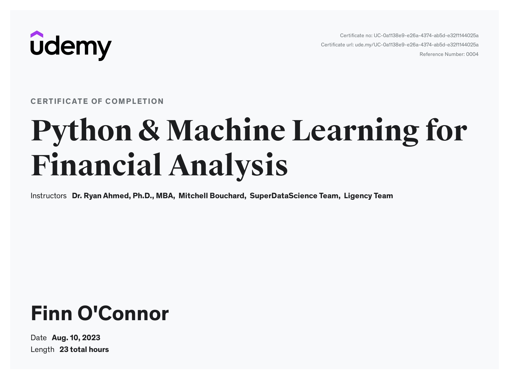

# Certifications

## Dataquest: Data Scientist in Python Path

### Completed Courses

| Part | Course | Certificate | Date |
|---|--------|-------------|------|
| 1 | Python Introduction | [View Certificate](https://app.dataquest.io/view_cert/I3WJAQDSAN0ZULR486XN) | January 2025 |
| 2 | Data Analysis and Visualization | [View Certificate](https://app.dataquest.io/view_cert/L8VRTOQPMW8T33EYGEP3) | February 2025 |
| 3 | Data Cleaning | In Progress | - |
| 4 | The Command Line | - | - |
| 5 | Working with Data Sources Using SQL | - | - |
| 6 | APIs and Web Scraping in Python | - | - |
| 7 | Probability and Statistics | - | - |
| 8 | Machine Learning in Python | - | - |
| 9 | Deep Learning in Python | - | - |
| 10 | Advanced Topics in Data Science | - | - |

### Final Certification

🎯 **Data Scientist in Python** - Pending

---

## Udemy: Python & Machine Learning for Financial Analysis

**Completed:** August 2023

[View Certificate](https://www.udemy.com/certificate/UC-0a1138e9-e26a-4374-ab5d-e32f1144025a/)

---

## Bloomberg Market Concepts

**Completed:** July 2023

[View Certificate](https://portal.bloombergforeducation.com/certificates/dGjBgZwiNp3T4fwNGjtCoNTk)
